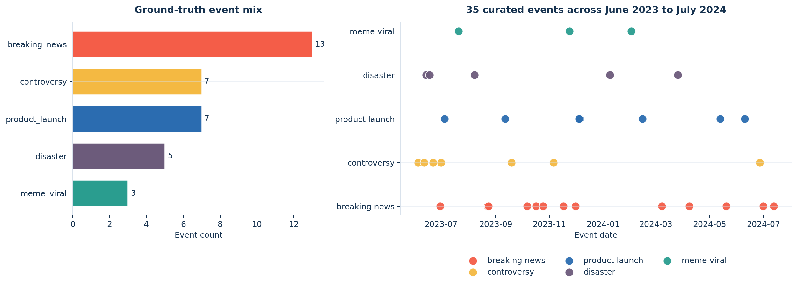
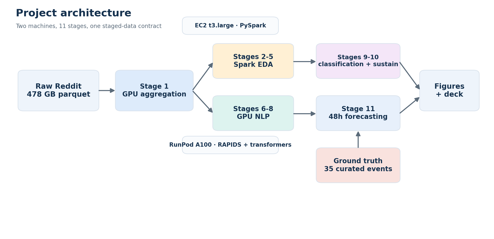
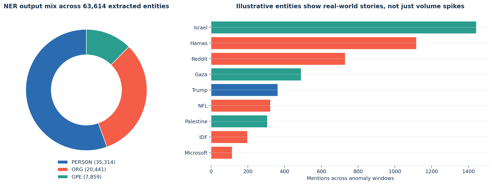
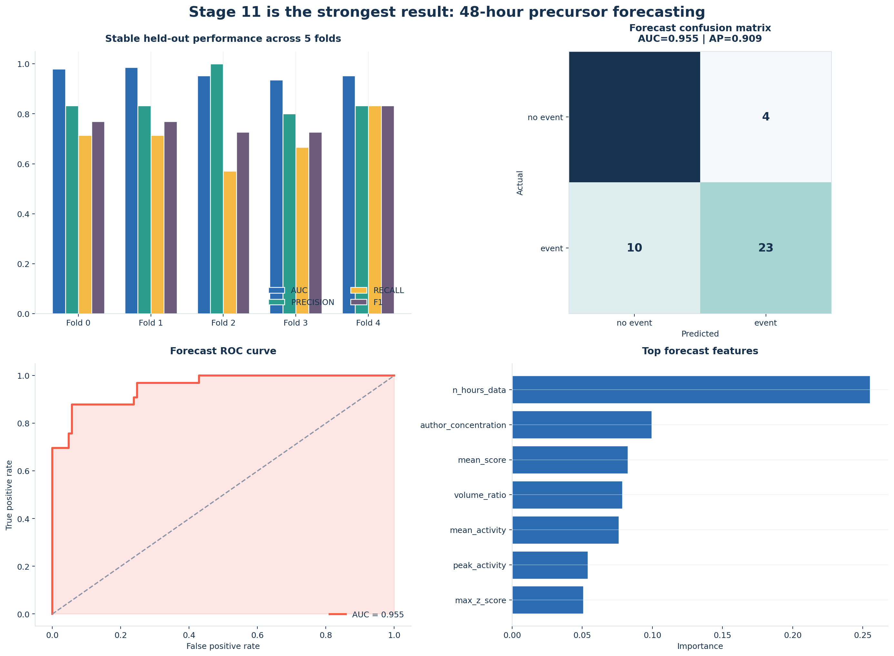
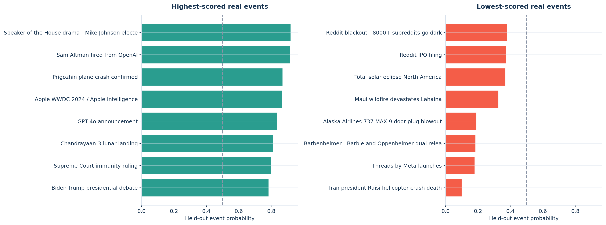

## Reddit as an Early Warning System

:::: {.columns}
::: {.column width="43%"}

DATS 6450 · Group 3

Can Reddit act as a practical early-warning radar for real-world events?

<strong>Main story:</strong> at our current label volume, Reddit works better as a <strong>binary early-warning system</strong> than as a full event taxonomy engine.

  
1.27Bcomments + submissions processed

  
478 GBraw Pushshift Reddit data

  
11pipeline stages

  
0.955best result: forecast AUC

Every number and figure in this deck was regenerated from the local staged outputs under <code>data/intermediate/</code>.

:::

::: {.column width="57%"}

:::
::::

::: {.notes}
Target: 35 seconds.

Open with the thesis, not the tooling. We asked whether Reddit can behave like an early-warning sensor. The strongest answer is yes for binary forecasting, not yet for precise event labeling.
:::

## Why This Matters

Business Intelligence Framing

  

    <h3>Journalism and media desks</h3>
    
Flag emerging stories before they peak on mainstream outlets, especially in niche communities that move first.

  

  

    <h3>Trust and safety triage</h3>
    
Spot coordinated attention spikes that may need moderation, escalation, or human review.

  

  

    <h3>PR and reputation monitoring</h3>
    
Track whether concentrated author activity is building around a company, policy, or public figure.

  

  

    <h3>Product launch monitoring</h3>
    
Measure whether launch-related chatter is building ahead of official announcements or broad press coverage.

  

  <h3>The operating assumption</h3>
  
Collective attention often moves before formal coverage does. If Reddit communities show measurable precursor behavior, the useful product is a triage signal: <strong>something important may be about to happen</strong>.

::: {.notes}
Target: 55 seconds.

This slide is the business hook. Position the project as a monitoring and triage system, not a replacement for journalism or a perfect world-event detector.
:::

## Data and Ground Truth

:::: {.columns}
::: {.column width="36%"}
### What We Actually Analyzed

| Metric | Value |
|---|---:|
| Time range | 14 months |
| Raw scale | 478 GB |
| Total posts | 1.27B |
| Top subreddits | 500 |
| Hourly rows after aggregation | 9.38M |
| Curated events | 35 |

### Event mix

| Category | Count |
|---|---:|
| Breaking news | 13 |
| Controversy | 7 |
| Product launch | 7 |
| Disaster | 5 |
| Meme / viral | 3 |

Example events in the catalog: Reddit blackout, Titan implosion, Sam Altman / OpenAI, GPT-4o, total solar eclipse, and the Trump assassination attempt.
:::

::: {.column width="64%"}
::: {.figure-stack}

:::
:::
::::

::: {.notes}
Target: 1 minute.

Emphasize scale plus curation. The raw dataset is huge, but evaluation still depends on a small hand-curated event catalog. Also note that these category counts come directly from the current CSV, not from older report text.
:::

## How the 11-Stage Pipeline Works

{width="100%"}

:::: {.columns}
::: {.column width="52%"}
- **EC2 handled the Spark work.** Rolling windows, anomaly detection, propagation, spike shapes, and timing are I/O-heavy analytics jobs.
- **The A100 handled the GPU work.** Aggregation, NER, sentiment, topics, and ML all benefit from RAPIDS and transformer inference.
:::

::: {.column width="48%"}
- **The data contract is parquet.** Each stage writes compact intermediate outputs that the next stage can consume offline.
- **That separation is why this deck is reproducible.** We rebuilt the figures directly from `data/intermediate/` without rerunning the cloud pipeline.
:::
::::

::: {.notes}
Target: 1 minute 5 seconds.

This slide proves the project did more than train one model. Walk quickly through the full pipeline and reinforce that every stage appears somewhere in the deck.
:::

## Detection Works at Scale

  
<strong>31,938</strong> anomaly windows

  
<strong>499 / 500</strong> subreddits with at least one anomaly

  
<strong>21 / 35</strong> ground-truth events matched in a conservative +/-24h check

The coverage check is intentionally strict: we require a listed subreddit and a time overlap within one day of the event date.

::: {.notes}
Target: 1 minute 15 seconds.

Lead with the success: anomaly detection is broad and clearly aligned with major news cycles. Then add the caveat: 21 of 35 is promising but not perfect, and that is exactly why the final story should be early warning, not exhaustive event recall.
:::

## What Events Look Like on Reddit

:::: {.columns}
::: {.column width="62%"}

:::

::: {.column width="38%"}

  <h3>Stages 3-5 in one slide</h3>
  <ul>
    <li><strong>Temporal patterns were useful.</strong> The peak slot is <code>Tue 16:00 UTC</code>, and weekday anomaly volume is materially higher than weekend volume.</li>
    <li><strong>Ground-truth categories differ in timing.</strong> Breaking news and controversies skew midweek, while product and meme events tilt later in the week.</li>
    <li><strong>We also ran propagation and spike-shape analysis.</strong> Those stages executed successfully, but the parameters need retuning before we treat them as final evidence.</li>
  </ul>
  
This is why the timing signal appears here, while the propagation and morphology caveats move to the dedicated limitation slide.

:::
::::

::: {.notes}
Target: 1 minute 10 seconds.

This slide covers stages 3 through 5 without overselling propagation or spike shapes. Make the point that timing is already actionable, while the other two need tuning.
:::

## What the Text Reveals

  

    <h3>What worked</h3>
    <ul>
      <li><strong>NER was the strongest NLP stage.</strong> We extracted <strong>63,614</strong> entity rows across <strong>1,738</strong> anomaly windows.</li>
      <li><strong>The signal is narratively sensible.</strong> Israel, Hamas, Reddit, Gaza, Trump, NFL, and Microsoft all surfaced from real anomaly windows.</li>
    </ul>
  

  

    <h3>What remains partial</h3>
    <ul>
      <li><strong>Sentiment covered only 2 windows.</strong></li>
      <li><strong>Topics covered 50 windows.</strong></li>
      <li>Business takeaway: entity extraction already turns spikes into recognizable stories, even before the full sentiment and topic sweeps are complete.</li>
    </ul>
  

::: {.notes}
Target: 1 minute 10 seconds.

Keep this honest. The text signal is real and useful, but only the NER stage reached presentation-grade scale. Sentiment and topic modeling should be described as partial probes, not finished evidence.
:::

## ML Before Forecasting

  

    <h3>Stages 9-10 were informative failures</h3>
    <ul>
      <li><strong>Stage 9 classification failed cleanly.</strong> All 500 predictions collapsed to <code>breaking_news</code>.</li>
      <li><strong>Stage 10 had ranking signal but poor thresholded decisions.</strong> AUC was <strong>0.949</strong>, but positive-class F1 was <strong>0.0</strong> because only <strong>7 / 500</strong> cases were truly sustained.</li>
      <li><strong>Main lesson:</strong> with this label volume, binary forecasting is a much better framing than five-class anomaly typing.</li>
    </ul>
  

::: {.notes}
Target: 1 minute 5 seconds.

Call these honest negatives. They are not wasted work; they tell us which framing is tractable at the current sample size.
:::

## Strongest Result: 48-Hour Forecasting

:::: {.columns}
::: {.column width="38%"}
### Held-out performance

| AUC | F1 | Precision | Recall |
|---:|---:|---:|---:|
| 0.955 | 0.767 | 0.852 | 0.697 |
:::

::: {.column width="62%"}
### Why this is the key story

- The model uses a **48-hour precursor window** ending before the event, so it cannot see the event itself.
- The strongest features are **n_hours_data**, **author_concentration**, **mean_score**, and **volume_ratio**.
- Highest-scored positives included **Sam Altman fired**, **WWDC 2024**, **GPT-4o**, and **Mike Johnson elected**.
:::
::::

::: {.notes}
Target: 1 minute 25 seconds.

This is the money slide. Explain the setup, the stability across folds, and the feature story: not just giant spikes, but concentrated and persistent precursor behavior.
:::

## What Didn’t Work Yet

Single-slide honesty

| Component | Why it cannot be used as-is | What we would fix next |
|---|---|---|
| Propagation | A 48-hour overlap rule collapsed the graph into one giant component. | Tighten to <=6 hours and require entity/topic overlap. |
| Spike shapes | 99.2% of windows became `double_peak`, which is a heuristic sensitivity issue. | Sweep `find_peaks` thresholds or move to template fitting. |
| Sentiment | Only 2 windows completed, so there is not enough coverage for a claim. | Re-run the full GPU sweep over the NER-covered windows. |
| Topics | The 50-window probe produced mostly noise labels. | Run BERTopic across the full eligible corpus, not the probe subset. |
| Classification | Stage 9 predicted `breaking_news` for all 500 cases. | Expand labels and add class balancing / semi-supervised labeling. |
| Sustain / decay | AUC was high, but thresholded positive precision and recall were zero. | Use class weighting and calibrate the decision threshold. |

These are fixable parameter, coverage, and label-volume problems. They do not invalidate the pipeline; they tell us where the next iteration should focus.

::: {.notes}
Target: 1 minute 25 seconds.

This slide should increase credibility. Move briskly row by row and make the fixes sound concrete and tractable.
:::

## What This Means

### Three takeaways

1. Reddit already works as a **large-scale detector of collective attention shifts**.
2. **Binary, event-anchored forecasting** is much stronger than five-class anomaly labeling at the current sample size.
3. The near-term product is **triage and early warning**, not a perfect end-to-end event taxonomy engine.

> Reddit is not yet good at telling us exactly *what kind* of event is happening, but it is already surprisingly good at telling us that **something important may be about to happen**.

::: {.notes}
Target: 50 seconds.

End by repeating the central reframing: this is an early-warning and triage engine first, not yet a fully mature event taxonomy system.
:::

## Thank You

::: {.thank-you}
Questions?

Group 3 · Reddit as an Early Warning System
:::

::: {.notes}
Keep this brief and pause for questions.
:::

## Appendix

:::: {.columns}
::: {.column width="67%"}

:::

::: {.column width="33%"}
### Backup Notes

- The deck uses the current `events.csv` counts: `13 / 7 / 7 / 5 / 3`.
- Conservative anomaly alignment is `21 / 35` events within `+/-24h` on listed subreddits.
- Forecast examples perform best for product launches, controversies, and some breaking-news events with clear precursor chatter.

### Image Credits

- Reddit screenshot: Wikipedia `Reddit`
- Titan image: Wikipedia `Titan submersible implosion`
- Sam Altman portrait: Wikipedia `Sam Altman`
- Eclipse image: Wikipedia `Solar eclipse of April 8, 2024`
:::
::::

::: {.notes}
Use this only for Q and A or if someone asks about the image sources or the strongest and weakest forecasted events.
:::
