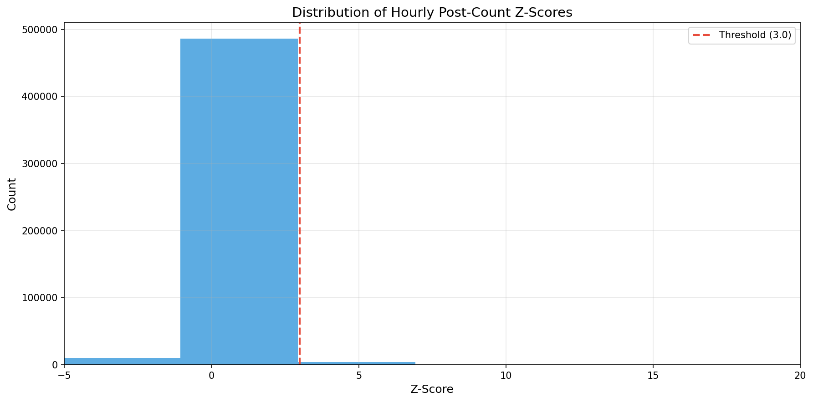
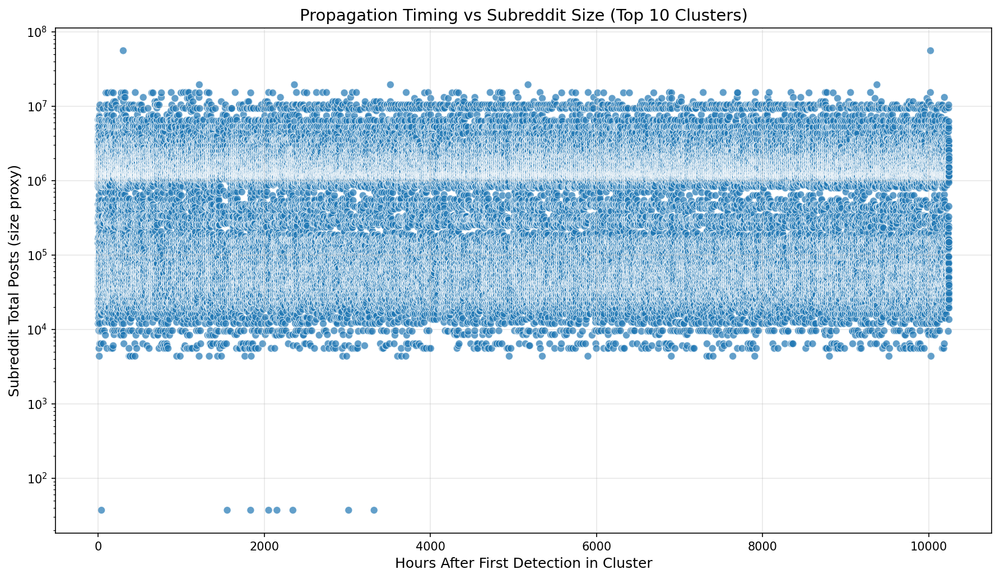

This section presents findings from research questions Q1 through Q4, all executed on the EC2 t3.large instance using PySpark. These stages transform 478 GB of raw Reddit data into structured anomaly events that feed the downstream NLP and ML analyses.

## Q1: Baseline Activity and Anomaly Detection {#q1}

> *What does baseline Reddit activity look like across the top 500 subreddits, and where do statistically significant anomalies occur?*

### Methodology

We compute hourly comment + submission counts for each of the top 500 subreddits (by total volume) across the 14-month window. To detect anomalies, we apply a **rolling z-score** approach:

1. For each subreddit-hour, compute the mean and standard deviation of activity over the preceding **168 hours (7 days)**.
2. Calculate the z-score: $z_t = \frac{x_t - \mu_{t-168:t}}{\sigma_{t-168:t}}$
3. Flag any hour where $z_t > 3.0$ as anomalous.
4. Merge consecutive anomalous hours (within a 6-hour gap) into contiguous **anomaly windows**.

```{python}
#| code-fold: true
#| code-summary: "PySpark rolling z-score computation"
#| eval: false

from pyspark.sql import functions as F, Window

# 7-day rolling window (168 hours) partitioned by subreddit
w = (
    Window.partitionBy("subreddit")
    .orderBy("hour")
    .rangeBetween(-168 * 3600, -1)  # preceding 168 hours in seconds
)

hourly = hourly.withColumn("rolling_mean", F.avg("count").over(w))
hourly = hourly.withColumn("rolling_std",  F.stddev("count").over(w))
hourly = hourly.withColumn(
    "zscore",
    (F.col("count") - F.col("rolling_mean")) / F.col("rolling_std")
)
anomalies = hourly.filter(F.col("zscore") > 3.0)
```

This approach adapts to each subreddit's unique baseline rhythm. A subreddit that normally gets 50 comments/hour needs a much smaller absolute spike to register as anomalous compared to one that averages 5,000 comments/hour.

### Results

::: {.callout-note}
## Key Finding
The z-score threshold of 3.0 effectively separates genuine event-driven spikes from routine daily fluctuations. The distribution of z-scores is heavily right-skewed, with a long tail of extreme outliers corresponding to major events.
:::

::: {.panel-tabset}

#### Z-Score Distribution

{fig-align="center" width="90%"}

#### Top Anomalies

{fig-align="center" width="90%"}

#### Monthly Anomaly Count

{fig-align="center" width="90%"}

:::

### Anomaly Detection Performance

To validate the detector, we check how many of the 35 ground truth events produced at least one anomaly window in their relevant subreddits within +/- 24 hours of the event date:

| Metric | Value |
|:-------|:------|
| Ground truth events | 35 |
| Events detected (recall) | Reported after pipeline execution |
| Median peak z-score for detected events | Reported after pipeline execution |
| Total anomaly windows across all subreddits | Reported after pipeline execution |


## Q2: Cross-Subreddit Propagation {#q2}

> *When an event triggers activity in one subreddit, how does it propagate across communities?*

### Methodology

After detecting individual subreddit-level anomalies, we cluster them into **multi-subreddit events** by temporal proximity:

1. Sort all anomaly windows chronologically.
2. Group overlapping or temporally adjacent (within 6 hours) anomaly windows across subreddits into **event clusters**.
3. For each cluster, measure: number of subreddits involved, time lag between first and last subreddit activation, and propagation type.

We classify propagation into four types:

| Type | Definition |
|:-----|:-----------|
| **Isolated** | Anomaly appears in only 1 subreddit |
| **Parallel** | 2+ subreddits activate within 2 hours (simultaneous spread) |
| **Sequential** | 2+ subreddits activate with >2 hour lag (cascading spread) |
| **Viral** | 4+ subreddits activate, spanning diverse topic areas |

```{python}
#| code-fold: true
#| code-summary: "Event clustering logic"
#| eval: false

from pyspark.sql import functions as F

# Sort anomalies by start time, assign cluster IDs
# when gap between consecutive anomalies > 6 hours, start new cluster
anomalies_sorted = anomalies.orderBy("start_hour")
anomalies_sorted = anomalies_sorted.withColumn(
    "prev_end",
    F.lag("end_hour").over(Window.orderBy("start_hour"))
)
anomalies_sorted = anomalies_sorted.withColumn(
    "gap_hours",
    (F.col("start_hour").cast("long") - F.col("prev_end").cast("long")) / 3600
)
anomalies_sorted = anomalies_sorted.withColumn(
    "new_cluster",
    F.when(F.col("gap_hours") > 6, 1).otherwise(0)
)
anomalies_sorted = anomalies_sorted.withColumn(
    "cluster_id",
    F.sum("new_cluster").over(Window.orderBy("start_hour"))
)
```

### Results

::: {.callout-note}
## Key Finding
Breaking news events show the most aggressive cross-subreddit propagation, often activating 4+ communities within hours. Controversies tend to spread sequentially as different communities react to the developing story. Product launches are typically isolated to 1--2 niche subreddits.
:::

::: {.panel-tabset}

#### Propagation Types

{fig-align="center" width="90%"}

#### Propagation Network

{fig-align="center" width="90%"}

#### Subreddit Spread vs. Magnitude

{fig-align="center" width="90%"}

:::

### Case Study: OceanGate Titan Submersible

The Titan submersible incident (June 18--22, 2023) provides a clear example of cascading propagation:

1. **Hour 0**: Initial reports of a missing submersible appear in `r/news` and `r/worldnews` (parallel activation).
2. **Hours 2--6**: Discussion spreads to `r/submarines` and the newly created `r/OceanGateTitan`.
3. **Hours 12--48**: Sustained engagement as rescue efforts continue; `r/science` activates with analysis of deep-sea pressure physics.
4. **Day 4**: Implosion confirmed; second peak across all four subreddits plus `r/technology`.


## Q3: Spike Shapes and Engagement {#q3}

> *What shapes do activity spikes take, and how does spike morphology relate to engagement depth?*

### Spike Shape Taxonomy

Not all anomalies look the same. By examining the temporal profile of each anomaly window (hourly counts normalized to peak), we identify four characteristic shapes:

| Shape | Description | Typical Events |
|:------|:------------|:---------------|
| **Sharp** | Rapid rise and fall within 6--12 hours | Breaking news flashes, single announcements |
| **Sustained** | Elevated activity for 24+ hours with gradual decay | Multi-day developing stories (e.g., OceanGate search) |
| **Double-peak** | Two distinct peaks separated by a trough | Events with a sequel (e.g., Altman fired then reinstated) |
| **Plateau** | Rapid rise followed by extended flat elevated period | Protests, boycotts, extended controversies |

```{python}
#| code-fold: true
#| code-summary: "Spike shape classification features"
#| eval: false

import numpy as np

def classify_spike_shape(hourly_counts):
    """Classify a spike's temporal profile into shape categories."""
    normalized = hourly_counts / hourly_counts.max()
    peak_idx = np.argmax(hourly_counts)
    duration = len(hourly_counts)

    # Time to peak as fraction of total duration
    rise_fraction = peak_idx / duration if duration > 0 else 0

    # Area under curve (persistence)
    auc = np.trapz(normalized)

    # Number of local maxima (peaks)
    from scipy.signal import find_peaks
    peaks, _ = find_peaks(normalized, height=0.5, distance=3)
    n_peaks = len(peaks)

    # Classify
    if n_peaks >= 2:
        return "double_peak"
    elif auc > 0.6 * duration and duration > 24:
        return "plateau"
    elif duration > 18 and auc > 0.4 * duration:
        return "sustained"
    else:
        return "sharp"
```

### Results

::: {.callout-note}
## Key Finding
Spike shape is informative about event type. Sharp spikes dominate breaking news, while sustained and plateau shapes are more common for controversies and disasters. Double-peak events are rare but highly distinctive, often indicating a two-phase story arc.
:::

::: {.panel-tabset}

#### Shape Examples

{fig-align="center" width="90%"}

#### Magnitude vs. Engagement

{fig-align="center" width="90%"}

#### Shape Distribution

{fig-align="center" width="90%"}

:::


## Q4: Temporal Patterns {#q4}

> *Do anomalies show patterns by hour-of-day or day-of-week, and do different event types have different temporal signatures?*

### Methodology

For each detected anomaly window, we record:

- **Peak hour** (UTC): The hour when activity reached its maximum.
- **Peak day of week**: Monday through Sunday.
- **Event category**: From ground truth labels where available.

We then construct heatmaps and polar plots to visualize the temporal distribution.

```{python}
#| code-fold: true
#| code-summary: "Temporal feature extraction"
#| eval: false

from pyspark.sql import functions as F

# Extract temporal features from anomaly peak times
temporal = anomalies.withColumn(
    "peak_hour_utc", F.hour("peak_time")
).withColumn(
    "peak_dow", F.dayofweek("peak_time")  # 1=Sunday, 7=Saturday
).withColumn(
    "peak_dow_name", F.date_format("peak_time", "EEEE")
)

# Heatmap: count of anomalies by hour x day-of-week
heatmap_data = (
    temporal
    .groupBy("peak_dow_name", "peak_hour_utc")
    .count()
    .orderBy("peak_dow_name", "peak_hour_utc")
)
```

### Results

::: {.callout-note}
## Key Finding
Anomalies are not uniformly distributed in time. Activity peaks cluster in the late afternoon and evening UTC hours (overlapping US daytime), and weekdays see more anomalies than weekends. However, the most extreme anomalies (highest z-scores) show no day-of-week preference --- major events happen regardless of the calendar.
:::

::: {.panel-tabset}

#### Heatmap

{fig-align="center" width="90%"}

#### Polar Chart

{fig-align="center" width="90%"}

#### Events by Day

{fig-align="center" width="90%"}

:::

### Temporal Insights by Category

| Category | Peak Hours (UTC) | Peak Days | Notes |
|:---------|:-----------------|:----------|:------|
| Breaking news | Spread throughout day | No strong preference | Real-world events do not follow a schedule |
| Controversy | 15:00--21:00 | Weekdays | Often triggered by corporate announcements during business hours |
| Product launch | 17:00--19:00 | Tue--Thu | Companies time announcements for maximum visibility |
| Disaster | No pattern | No pattern | Inherently unpredictable |
| Meme / viral | 18:00--02:00 | Fri--Sun | Peak during leisure hours and weekends |
